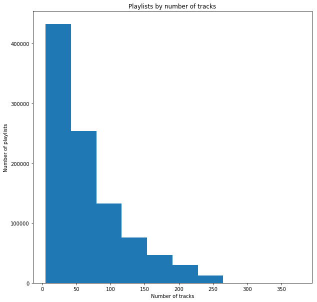

#### Original data
    
1m playlists along with tracks (songs)/albums/artists which are part of particular playlist. Data is in JSON format, split into 1000 files. After download, we adjusted code provided with the dataset to read, clean and reconcile the data.

#### Problem
    
Size. Loaded as-is, this dataset wouldn’t fit into memory (~66m records). Names of songs / artists / playlists are duplicated which is a waste. Therefore, preprocessing utility was adjusted to split data into tables, adding ids for each entry: songs, artists, albums, playlists, tracks. Names were sanitized: brought to lower case, removed leading/trailing space, removed non-ASCII letter symbols, skipped entry if resulting string is empty (some names were
all-hieroglyphs). This also allowed an easier analysis of tables (i.e. group by names). Even after the data normalization, track data wouldn’t fit into a notebook with 8Gb of RAM. That, plus early results of EDA (~70% of track data belongs to playlists with just 1 follower), led to removing track data that has a single follower. Resulting dataframe fits into RAM.

#### Song details 
('danceability', 'energy', 'key', 'loudness', 'mode', 'speechiness', 'acousticness', 'instrumentalness', 'liveness', 'valence', 'tempo', 'time_signature') are being downloaded through Spotify’s REST API (using Spotify ID from playlist dataset to reconcile data). It’s a slow and laborious process because authentication token must be re-taken every hour (manually) plus there’s a rate limit (~4 songs per second). At this point, ~90% data has been downloaded.

#### After cleaning and preprocessing :
* Songs: 1389690. Not all songs are found in Spotify – hence post-join with playlist tracks
entries which have N/A are dropped. Since this is a rare occurrence, we don’t expect major
impact on quality. Spotify URI is used to fetch song details (danceability, loudness, etc)
* Artists: 281893. Names are used to find match in similarity dataset but otherwise only
having “same” artist (same id) seems to be important for playlists
* Albums: 547603. Same as artist: use for matching but otherwise track-album id is used
* Playlists: 984547; after dropping single-follower and top-follower (71643) playlists: 241799
* Tracks: 65138632; after dropping single-follower playlists: 19822736; after joining to song
details 18660867 (preliminary - song details download is in-progress)

#### Playlist names 

(17384 unique entries) don’t look descriptive: although some provide context (e.g. decade-related ‘00s’ repeated 219 times, ‘10’ – 175; mood: ‘zone’ - 107 ‘zumba’ – 342, ‘zombie’ - 25), many names look strange (‘zzz’ – 218 times). Until more promising modelling is done, no lexical matching is done on names.

#### Number of playlists by followers

Are heavily skewed by playlists with few followers, details below

#### Engineered features for playlists

Joining back track data with song details and representing playlist by its own data (number of tracks/albums/followers) and aggregating (depending on the field - e.g max mode) of song data per playlist, gives engineered features of the playlist (all fields range 0-1 for modelling) which allows modelling of playlists – e.g. clustering based on these features.

#### PCA 

It was done on these features: 88% of variation is explained by 4 components. Since number of engineered features is not large, PCA is not used in modelling.


```python
import sys
import json
import codecs
import datetime
import numpy as np
import pandas as pd
import string
DATA_DIR="./data/data"

```


```python
df = pd.read_csv(DATA_DIR + '/preproc.csv.gz', compression='gzip')
dfAugSongs = pd.read_csv(DATA_DIR + '/full_aug_songs.csv.gz', compression='gzip')
dfPlaylists = pd.read_csv(DATA_DIR + '/playlists.csv.gz', compression='gzip')
```


```python
nfol = dfPlaylists.groupby('num_followers').agg(['count'])

```


```python
nfol[nfol > 50].dropna()
```


<div>
<style scoped>
    .dataframe tbody tr th:only-of-type {
        vertical-align: middle;
    }

    .dataframe tbody tr th {
        vertical-align: top;
    }

    .dataframe thead tr th {
        text-align: left;
    }

    .dataframe thead tr:last-of-type th {
        text-align: right;
    }
</style>
<table border="1" class="dataframe">
  <thead>
    <tr>
      <th></th>
      <th>id</th>
      <th>name</th>
      <th>collaborative</th>
      <th>num_tracks</th>
      <th>num_albums</th>
    </tr>
    <tr>
      <th></th>
      <th>count</th>
      <th>count</th>
      <th>count</th>
      <th>count</th>
      <th>count</th>
    </tr>
    <tr>
      <th>num_followers</th>
      <th></th>
      <th></th>
      <th></th>
      <th></th>
      <th></th>
    </tr>
  </thead>
  <tbody>
    <tr>
      <th>1</th>
      <td>742663.0</td>
      <td>742659.0</td>
      <td>742663.0</td>
      <td>742663.0</td>
      <td>742663.0</td>
    </tr>
    <tr>
      <th>2</th>
      <td>147138.0</td>
      <td>147137.0</td>
      <td>147138.0</td>
      <td>147138.0</td>
      <td>147138.0</td>
    </tr>
    <tr>
      <th>3</th>
      <td>46178.0</td>
      <td>46178.0</td>
      <td>46178.0</td>
      <td>46178.0</td>
      <td>46178.0</td>
    </tr>
    <tr>
      <th>4</th>
      <td>19304.0</td>
      <td>19304.0</td>
      <td>19304.0</td>
      <td>19304.0</td>
      <td>19304.0</td>
    </tr>
    <tr>
      <th>5</th>
      <td>9669.0</td>
      <td>9669.0</td>
      <td>9669.0</td>
      <td>9669.0</td>
      <td>9669.0</td>
    </tr>
    <tr>
      <th>6</th>
      <td>5276.0</td>
      <td>5276.0</td>
      <td>5276.0</td>
      <td>5276.0</td>
      <td>5276.0</td>
    </tr>
    <tr>
      <th>7</th>
      <td>3256.0</td>
      <td>3256.0</td>
      <td>3256.0</td>
      <td>3256.0</td>
      <td>3256.0</td>
    </tr>
    <tr>
      <th>8</th>
      <td>2119.0</td>
      <td>2119.0</td>
      <td>2119.0</td>
      <td>2119.0</td>
      <td>2119.0</td>
    </tr>
    <tr>
      <th>9</th>
      <td>1494.0</td>
      <td>1494.0</td>
      <td>1494.0</td>
      <td>1494.0</td>
      <td>1494.0</td>
    </tr>
    <tr>
      <th>10</th>
      <td>998.0</td>
      <td>998.0</td>
      <td>998.0</td>
      <td>998.0</td>
      <td>998.0</td>
    </tr>
    <tr>
      <th>11</th>
      <td>820.0</td>
      <td>820.0</td>
      <td>820.0</td>
      <td>820.0</td>
      <td>820.0</td>
    </tr>
    <tr>
      <th>12</th>
      <td>626.0</td>
      <td>626.0</td>
      <td>626.0</td>
      <td>626.0</td>
      <td>626.0</td>
    </tr>
    <tr>
      <th>13</th>
      <td>468.0</td>
      <td>468.0</td>
      <td>468.0</td>
      <td>468.0</td>
      <td>468.0</td>
    </tr>
    <tr>
      <th>14</th>
      <td>356.0</td>
      <td>356.0</td>
      <td>356.0</td>
      <td>356.0</td>
      <td>356.0</td>
    </tr>
    <tr>
      <th>15</th>
      <td>325.0</td>
      <td>325.0</td>
      <td>325.0</td>
      <td>325.0</td>
      <td>325.0</td>
    </tr>
    <tr>
      <th>16</th>
      <td>285.0</td>
      <td>285.0</td>
      <td>285.0</td>
      <td>285.0</td>
      <td>285.0</td>
    </tr>
    <tr>
      <th>17</th>
      <td>232.0</td>
      <td>232.0</td>
      <td>232.0</td>
      <td>232.0</td>
      <td>232.0</td>
    </tr>
    <tr>
      <th>18</th>
      <td>206.0</td>
      <td>206.0</td>
      <td>206.0</td>
      <td>206.0</td>
      <td>206.0</td>
    </tr>
    <tr>
      <th>19</th>
      <td>161.0</td>
      <td>161.0</td>
      <td>161.0</td>
      <td>161.0</td>
      <td>161.0</td>
    </tr>
    <tr>
      <th>20</th>
      <td>137.0</td>
      <td>137.0</td>
      <td>137.0</td>
      <td>137.0</td>
      <td>137.0</td>
    </tr>
    <tr>
      <th>21</th>
      <td>117.0</td>
      <td>117.0</td>
      <td>117.0</td>
      <td>117.0</td>
      <td>117.0</td>
    </tr>
    <tr>
      <th>22</th>
      <td>124.0</td>
      <td>124.0</td>
      <td>124.0</td>
      <td>124.0</td>
      <td>124.0</td>
    </tr>
    <tr>
      <th>23</th>
      <td>106.0</td>
      <td>106.0</td>
      <td>106.0</td>
      <td>106.0</td>
      <td>106.0</td>
    </tr>
    <tr>
      <th>24</th>
      <td>95.0</td>
      <td>95.0</td>
      <td>95.0</td>
      <td>95.0</td>
      <td>95.0</td>
    </tr>
    <tr>
      <th>25</th>
      <td>66.0</td>
      <td>66.0</td>
      <td>66.0</td>
      <td>66.0</td>
      <td>66.0</td>
    </tr>
    <tr>
      <th>26</th>
      <td>69.0</td>
      <td>69.0</td>
      <td>69.0</td>
      <td>69.0</td>
      <td>69.0</td>
    </tr>
    <tr>
      <th>27</th>
      <td>73.0</td>
      <td>73.0</td>
      <td>73.0</td>
      <td>73.0</td>
      <td>73.0</td>
    </tr>
    <tr>
      <th>28</th>
      <td>70.0</td>
      <td>70.0</td>
      <td>70.0</td>
      <td>70.0</td>
      <td>70.0</td>
    </tr>
    <tr>
      <th>29</th>
      <td>71.0</td>
      <td>71.0</td>
      <td>71.0</td>
      <td>71.0</td>
      <td>71.0</td>
    </tr>
    <tr>
      <th>31</th>
      <td>64.0</td>
      <td>64.0</td>
      <td>64.0</td>
      <td>64.0</td>
      <td>64.0</td>
    </tr>
    <tr>
      <th>32</th>
      <td>60.0</td>
      <td>60.0</td>
      <td>60.0</td>
      <td>60.0</td>
      <td>60.0</td>
    </tr>
    <tr>
      <th>36</th>
      <td>65.0</td>
      <td>65.0</td>
      <td>65.0</td>
      <td>65.0</td>
      <td>65.0</td>
    </tr>
  </tbody>
</table>
</div>


```python
dfNumFol = dfPlaylists[dfPlaylists.num_followers > 1] # remove min
dfNumFol = dfNumFol[dfNumFol.num_followers < 71643] # remove max as outlier
dfPlNumFol = pd.merge(df, dfNumFol, left_on='playlist_id', right_on='id', how='left').dropna()

```


```python
dfPlNumFol.drop(['id_y', 'name', 'num_followers', 'collaborative', 'num_tracks', 'num_albums'], axis=1, inplace=True)

```


```python
dfPlNumFol.rename(columns={'id_x': 'pidpos_id'}, inplace=True)

```


```python
dfPlNumFol.to_csv(DATA_DIR + '/pidpos.csv.gz', compression="gzip")

```


```python
import matplotlib.pyplot as plt
plt.hist(dfPlaylists.num_followers);

```


```python
fig, ax = plt.subplots(1, 2, figsize=(10, 10))
ax[0].hist(dfPlaylists[dfPlaylists.num_followers > 0].num_followers)
ax[0].set_title("Playlists by followers")
ax[0].set_xlabel('Number of followers')
ax[0].set_ylabel('Number of playlists')
ax[1].hist(dfPlaylists[dfPlaylists.num_followers > 1000].num_followers)
ax[1].set_title("Playlists by followers over 1000")
ax[1].set_xlabel('Number of followers')
ax[1].set_ylabel('Number of playlists');

```


```python
dfSongs = pd.read_csv(DATA_DIR + '/orig_songs.csv.gz', compression='gzip')
dfSongs.head()

```


<div>
<style scoped>
    .dataframe tbody tr th:only-of-type {
        vertical-align: middle;
    }

    .dataframe tbody tr th {
        vertical-align: top;
    }

    .dataframe thead th {
        text-align: right;
    }
</style>
<table border="1" class="dataframe">
  <thead>
    <tr style="text-align: right;">
      <th></th>
      <th>name</th>
      <th>id</th>
      <th>uri</th>
      <th>duration_ms</th>
    </tr>
  </thead>
  <tbody>
    <tr>
      <th>0</th>
      <td>lose control feat ciara fat man scoop</td>
      <td>0</td>
      <td>0UaMYEvWZi0ZqiDOoHU3YI</td>
      <td>226.863</td>
    </tr>
    <tr>
      <th>1</th>
      <td>toxic</td>
      <td>1</td>
      <td>6I9VzXrHxO9rA9A5euc8Ak</td>
      <td>198.800</td>
    </tr>
    <tr>
      <th>2</th>
      <td>crazy in love</td>
      <td>2</td>
      <td>0WqIKmW4BTrj3eJFmnCKMv</td>
      <td>235.933</td>
    </tr>
    <tr>
      <th>3</th>
      <td>rock your body</td>
      <td>3</td>
      <td>1AWQoqb9bSvzTjaLralEkT</td>
      <td>267.266</td>
    </tr>
    <tr>
      <th>4</th>
      <td>it wasnt me</td>
      <td>4</td>
      <td>1lzr43nnXAijIGYnCT8M8H</td>
      <td>227.600</td>
    </tr>
  </tbody>
</table>
</div>


```python
dfAugSongs.describe()

```


<div>
<style scoped>
    .dataframe tbody tr th:only-of-type {
        vertical-align: middle;
    }

    .dataframe tbody tr th {
        vertical-align: top;
    }

    .dataframe thead th {
        text-align: right;
    }
</style>
<table border="1" class="dataframe">
  <thead>
    <tr style="text-align: right;">
      <th></th>
      <th>id</th>
      <th>duration</th>
      <th>danceability</th>
      <th>energy</th>
      <th>key</th>
      <th>loudness</th>
      <th>mode</th>
      <th>speechiness</th>
      <th>acousticness</th>
      <th>instrumentalness</th>
      <th>liveness</th>
      <th>valence</th>
      <th>tempo</th>
      <th>time_signature</th>
    </tr>
  </thead>
  <tbody>
    <tr>
      <th>count</th>
      <td>265512.000000</td>
      <td>265512.000000</td>
      <td>265512.000000</td>
      <td>265512.000000</td>
      <td>265512.000000</td>
      <td>265512.000000</td>
      <td>265512.000000</td>
      <td>265512.000000</td>
      <td>265512.000000</td>
      <td>265512.000000</td>
      <td>265512.000000</td>
      <td>265512.000000</td>
      <td>265512.000000</td>
      <td>265512.000000</td>
    </tr>
    <tr>
      <th>mean</th>
      <td>132317.224099</td>
      <td>244.971160</td>
      <td>0.564075</td>
      <td>0.618639</td>
      <td>5.260873</td>
      <td>-8.648893</td>
      <td>0.652961</td>
      <td>0.091223</td>
      <td>0.301750</td>
      <td>0.163255</td>
      <td>0.209394</td>
      <td>0.476525</td>
      <td>120.758935</td>
      <td>3.900811</td>
    </tr>
    <tr>
      <th>std</th>
      <td>76351.805012</td>
      <td>128.179798</td>
      <td>0.179457</td>
      <td>0.249564</td>
      <td>3.571320</td>
      <td>5.021407</td>
      <td>0.476029</td>
      <td>0.108825</td>
      <td>0.328518</td>
      <td>0.309849</td>
      <td>0.187564</td>
      <td>0.261506</td>
      <td>29.444708</td>
      <td>0.427773</td>
    </tr>
    <tr>
      <th>min</th>
      <td>0.000000</td>
      <td>0.000000</td>
      <td>0.000000</td>
      <td>0.000000</td>
      <td>0.000000</td>
      <td>-60.000000</td>
      <td>0.000000</td>
      <td>0.000000</td>
      <td>0.000000</td>
      <td>0.000000</td>
      <td>0.000000</td>
      <td>0.000000</td>
      <td>0.000000</td>
      <td>0.000000</td>
    </tr>
    <tr>
      <th>25%</th>
      <td>66383.750000</td>
      <td>190.862000</td>
      <td>0.447000</td>
      <td>0.451000</td>
      <td>2.000000</td>
      <td>-10.486000</td>
      <td>0.000000</td>
      <td>0.035500</td>
      <td>0.018500</td>
      <td>0.000000</td>
      <td>0.096100</td>
      <td>0.260000</td>
      <td>97.953750</td>
      <td>4.000000</td>
    </tr>
    <tr>
      <th>50%</th>
      <td>132037.500000</td>
      <td>227.040000</td>
      <td>0.578000</td>
      <td>0.660000</td>
      <td>5.000000</td>
      <td>-7.333500</td>
      <td>1.000000</td>
      <td>0.048300</td>
      <td>0.152000</td>
      <td>0.000116</td>
      <td>0.129000</td>
      <td>0.467000</td>
      <td>120.075000</td>
      <td>4.000000</td>
    </tr>
    <tr>
      <th>75%</th>
      <td>198417.250000</td>
      <td>274.384500</td>
      <td>0.697000</td>
      <td>0.824000</td>
      <td>8.000000</td>
      <td>-5.335000</td>
      <td>1.000000</td>
      <td>0.091600</td>
      <td>0.554000</td>
      <td>0.091400</td>
      <td>0.268000</td>
      <td>0.687000</td>
      <td>139.440000</td>
      <td>4.000000</td>
    </tr>
    <tr>
      <th>max</th>
      <td>264795.000000</td>
      <td>5823.660000</td>
      <td>0.991000</td>
      <td>1.000000</td>
      <td>11.000000</td>
      <td>3.792000</td>
      <td>1.000000</td>
      <td>0.967000</td>
      <td>0.996000</td>
      <td>1.000000</td>
      <td>1.000000</td>
      <td>1.000000</td>
      <td>247.963000</td>
      <td>5.000000</td>
    </tr>
  </tbody>
</table>
</div>


```python
fig, ax = plt.subplots(1, 1, figsize=(10, 10))
ax.hist(dfPlaylists.num_tracks)
ax.set_title("Playlists by number of tracks")
ax.set_xlabel('Number of tracks')
ax.set_ylabel('Number of playlists');

```





```python
fig, ax = plt.subplots(1, 1, figsize=(10, 10))
ax.hist(dfPlaylists.num_albums)
ax.set_title("Playlists by number of albums")
ax.set_xlabel('Number of albums')
ax.set_ylabel('Number of playlists');

```


```python
dfPlTracks = pd.merge(df, dfNumFol, left_on='playlist_id', right_on='id', how='left').dropna()

```


```python
dfPlTracks.drop(['id_y', 'name', 'collaborative'], axis=1, inplace=True)
dfPlTracks.rename(columns={'id_x': 'pidpos_id'}, inplace=True)

```


```python
dfPlTracks.head()

```


<div>
<style scoped>
    .dataframe tbody tr th:only-of-type {
        vertical-align: middle;
    }

    .dataframe tbody tr th {
        vertical-align: top;
    }

    .dataframe thead th {
        text-align: right;
    }
</style>
<table border="1" class="dataframe">
  <thead>
    <tr style="text-align: right;">
      <th></th>
      <th>pidpos</th>
      <th>pidpos_id</th>
      <th>track_id</th>
      <th>album_id</th>
      <th>artist_id</th>
      <th>playlist_id</th>
      <th>num_followers</th>
      <th>num_tracks</th>
      <th>num_albums</th>
    </tr>
  </thead>
  <tbody>
    <tr>
      <th>281</th>
      <td>4-0</td>
      <td>281</td>
      <td>280</td>
      <td>225</td>
      <td>175</td>
      <td>4</td>
      <td>2.0</td>
      <td>17.0</td>
      <td>16.0</td>
    </tr>
    <tr>
      <th>282</th>
      <td>4-1</td>
      <td>282</td>
      <td>281</td>
      <td>226</td>
      <td>176</td>
      <td>4</td>
      <td>2.0</td>
      <td>17.0</td>
      <td>16.0</td>
    </tr>
    <tr>
      <th>283</th>
      <td>4-2</td>
      <td>283</td>
      <td>282</td>
      <td>227</td>
      <td>177</td>
      <td>4</td>
      <td>2.0</td>
      <td>17.0</td>
      <td>16.0</td>
    </tr>
    <tr>
      <th>284</th>
      <td>4-3</td>
      <td>284</td>
      <td>283</td>
      <td>228</td>
      <td>178</td>
      <td>4</td>
      <td>2.0</td>
      <td>17.0</td>
      <td>16.0</td>
    </tr>
    <tr>
      <th>285</th>
      <td>4-4</td>
      <td>285</td>
      <td>284</td>
      <td>229</td>
      <td>179</td>
      <td>4</td>
      <td>2.0</td>
      <td>17.0</td>
      <td>16.0</td>
    </tr>
  </tbody>
</table>
</div>


```python
dfPlSongs = pd.merge(dfPlTracks, dfAugSongs, left_on='track_id', right_on='id', how='left').dropna()

```


```python
dfPlSongs.head()

```


<div>
<style scoped>
    .dataframe tbody tr th:only-of-type {
        vertical-align: middle;
    }

    .dataframe tbody tr th {
        vertical-align: top;
    }

    .dataframe thead th {
        text-align: right;
    }
</style>
<table border="1" class="dataframe">
  <thead>
    <tr style="text-align: right;">
      <th></th>
      <th>pidpos</th>
      <th>pidpos_id</th>
      <th>track_id</th>
      <th>album_id</th>
      <th>artist_id</th>
      <th>playlist_id</th>
      <th>num_followers</th>
      <th>num_tracks</th>
      <th>num_albums</th>
      <th>name</th>
      <th>...</th>
      <th>key</th>
      <th>loudness</th>
      <th>mode</th>
      <th>speechiness</th>
      <th>acousticness</th>
      <th>instrumentalness</th>
      <th>liveness</th>
      <th>valence</th>
      <th>tempo</th>
      <th>time_signature</th>
    </tr>
  </thead>
  <tbody>
    <tr>
      <th>0</th>
      <td>4-0</td>
      <td>281</td>
      <td>280</td>
      <td>225</td>
      <td>175</td>
      <td>4</td>
      <td>2.0</td>
      <td>17.0</td>
      <td>16.0</td>
      <td>tonight tonight</td>
      <td>...</td>
      <td>6.0</td>
      <td>-9.381</td>
      <td>1.0</td>
      <td>0.0368</td>
      <td>0.000063</td>
      <td>0.748000</td>
      <td>0.2370</td>
      <td>0.222</td>
      <td>148.928</td>
      <td>4.0</td>
    </tr>
    <tr>
      <th>1</th>
      <td>4-1</td>
      <td>282</td>
      <td>281</td>
      <td>226</td>
      <td>176</td>
      <td>4</td>
      <td>2.0</td>
      <td>17.0</td>
      <td>16.0</td>
      <td>wonderwall remastered</td>
      <td>...</td>
      <td>2.0</td>
      <td>-4.066</td>
      <td>1.0</td>
      <td>0.0407</td>
      <td>0.000452</td>
      <td>0.000000</td>
      <td>0.1940</td>
      <td>0.469</td>
      <td>174.302</td>
      <td>4.0</td>
    </tr>
    <tr>
      <th>2</th>
      <td>4-2</td>
      <td>283</td>
      <td>282</td>
      <td>227</td>
      <td>177</td>
      <td>4</td>
      <td>2.0</td>
      <td>17.0</td>
      <td>16.0</td>
      <td>i dont want to miss a thing from the touchston...</td>
      <td>...</td>
      <td>2.0</td>
      <td>-5.163</td>
      <td>1.0</td>
      <td>0.0345</td>
      <td>0.172000</td>
      <td>0.000000</td>
      <td>0.2160</td>
      <td>0.144</td>
      <td>121.160</td>
      <td>4.0</td>
    </tr>
    <tr>
      <th>3</th>
      <td>4-3</td>
      <td>284</td>
      <td>283</td>
      <td>228</td>
      <td>178</td>
      <td>4</td>
      <td>2.0</td>
      <td>17.0</td>
      <td>16.0</td>
      <td>jealousy remastered single version</td>
      <td>...</td>
      <td>0.0</td>
      <td>-7.380</td>
      <td>1.0</td>
      <td>0.0343</td>
      <td>0.137000</td>
      <td>0.033500</td>
      <td>0.0857</td>
      <td>0.783</td>
      <td>100.994</td>
      <td>4.0</td>
    </tr>
    <tr>
      <th>4</th>
      <td>4-4</td>
      <td>285</td>
      <td>284</td>
      <td>229</td>
      <td>179</td>
      <td>4</td>
      <td>2.0</td>
      <td>17.0</td>
      <td>16.0</td>
      <td>waterfalls</td>
      <td>...</td>
      <td>1.0</td>
      <td>-7.345</td>
      <td>1.0</td>
      <td>0.0828</td>
      <td>0.311000</td>
      <td>0.000074</td>
      <td>0.0777</td>
      <td>0.757</td>
      <td>171.798</td>
      <td>4.0</td>
    </tr>
  </tbody>
</table>
<p>5 rows × 25 columns</p>
</div>


```python
dfPlSongs.columns

```


    Index(['pidpos', 'pidpos_id', 'track_id', 'album_id', 'artist_id',
           'playlist_id', 'num_followers', 'num_tracks', 'num_albums', 'name',
           'id', 'uri', 'duration', 'danceability', 'energy', 'key', 'loudness',
           'mode', 'speechiness', 'acousticness', 'instrumentalness', 'liveness',
           'valence', 'tempo', 'time_signature'],
          dtype='object')


```python
dfPlSongs.drop(['id', 'name', 'uri'], axis=1, inplace=True)

```


```python
dfPlGroupped = dfPlSongs.groupby('playlist_id')

```


```python
# trust direct count of tracks, not the field - some songs haven't been downloaded yet
# key (pitch) is integer hence - max
# loudness, tempo, time_signature: 'max'
# mode: drop (not mean, why max / min ?)
dfPlSongsAgg = dfPlGroupped.agg({'track_id': 'count', 'num_followers' : 'first', 'num_tracks' : 'first', 
                  'num_albums' : 'first', 'duration': 'mean', 
                  'danceability': 'mean', 'energy': 'mean', 'key' : 'max', 'loudness': 'max',
       'speechiness': 'mean', 'acousticness': 'mean', 'instrumentalness': 'mean', 'liveness': 'mean',
       'valence': 'mean', 'tempo': 'max', 'time_signature': 'max'}).rename(
    columns={'track_id': 'sum_num_tracks', 'duration': 'mean_duration', 'danceability': 'mean_danceability', 'energy': 'mean_energy', 
             'key' : 'max_key', 'loudness': 'max_loudness',
       'speechiness': 'mean_speechiness', 'acousticness': 'mean_acousticness', 
        'instrumentalness': 'mean_instrumentalness', 'liveness': 'mean_liveness',
       'valence': 'mean_valence', 'tempo': 'max_tempo', 'time_signature': 'max_time_signature' })
```


```python
dfPlSongsAgg.head()

```


<div>
<style scoped>
    .dataframe tbody tr th:only-of-type {
        vertical-align: middle;
    }

    .dataframe tbody tr th {
        vertical-align: top;
    }

    .dataframe thead th {
        text-align: right;
    }
</style>
<table border="1" class="dataframe">
  <thead>
    <tr style="text-align: right;">
      <th></th>
      <th>sum_num_tracks</th>
      <th>num_followers</th>
      <th>num_tracks</th>
      <th>num_albums</th>
      <th>mean_duration</th>
      <th>mean_danceability</th>
      <th>mean_energy</th>
      <th>max_key</th>
      <th>max_loudness</th>
      <th>mean_speechiness</th>
      <th>mean_acousticness</th>
      <th>mean_instrumentalness</th>
      <th>mean_liveness</th>
      <th>mean_valence</th>
      <th>max_tempo</th>
      <th>max_time_signature</th>
    </tr>
    <tr>
      <th>playlist_id</th>
      <th></th>
      <th></th>
      <th></th>
      <th></th>
      <th></th>
      <th></th>
      <th></th>
      <th></th>
      <th></th>
      <th></th>
      <th></th>
      <th></th>
      <th></th>
      <th></th>
      <th></th>
      <th></th>
    </tr>
  </thead>
  <tbody>
    <tr>
      <th>4</th>
      <td>17</td>
      <td>2.0</td>
      <td>17.0</td>
      <td>16.0</td>
      <td>255.016588</td>
      <td>0.576765</td>
      <td>0.650535</td>
      <td>9.0</td>
      <td>-4.066</td>
      <td>0.041159</td>
      <td>0.177148</td>
      <td>0.081875</td>
      <td>0.166524</td>
      <td>0.490765</td>
      <td>174.302</td>
      <td>4.0</td>
    </tr>
    <tr>
      <th>8</th>
      <td>46</td>
      <td>2.0</td>
      <td>46.0</td>
      <td>37.0</td>
      <td>216.280891</td>
      <td>0.512370</td>
      <td>0.686239</td>
      <td>11.0</td>
      <td>-3.009</td>
      <td>0.050311</td>
      <td>0.179107</td>
      <td>0.057182</td>
      <td>0.188674</td>
      <td>0.538587</td>
      <td>185.170</td>
      <td>4.0</td>
    </tr>
    <tr>
      <th>10</th>
      <td>72</td>
      <td>2.0</td>
      <td>72.0</td>
      <td>60.0</td>
      <td>229.388917</td>
      <td>0.725931</td>
      <td>0.626431</td>
      <td>11.0</td>
      <td>-1.578</td>
      <td>0.186018</td>
      <td>0.173206</td>
      <td>0.000086</td>
      <td>0.181185</td>
      <td>0.459111</td>
      <td>193.206</td>
      <td>4.0</td>
    </tr>
    <tr>
      <th>20</th>
      <td>14</td>
      <td>3.0</td>
      <td>14.0</td>
      <td>9.0</td>
      <td>171.202429</td>
      <td>0.824429</td>
      <td>0.573357</td>
      <td>11.0</td>
      <td>-3.062</td>
      <td>0.209914</td>
      <td>0.100930</td>
      <td>0.007138</td>
      <td>0.107114</td>
      <td>0.379657</td>
      <td>160.988</td>
      <td>4.0</td>
    </tr>
    <tr>
      <th>22</th>
      <td>42</td>
      <td>2.0</td>
      <td>42.0</td>
      <td>39.0</td>
      <td>215.148548</td>
      <td>0.645238</td>
      <td>0.622119</td>
      <td>11.0</td>
      <td>-3.093</td>
      <td>0.081374</td>
      <td>0.173115</td>
      <td>0.010118</td>
      <td>0.170240</td>
      <td>0.427000</td>
      <td>180.043</td>
      <td>5.0</td>
    </tr>
  </tbody>
</table>
</div>


```python
# incomplete song data - still being downloaded
dfPlSongsAgg[dfPlSongsAgg.sum_num_tracks != dfPlSongsAgg.num_tracks].max_key.count()

```


    152227


```python
# normalize
from sklearn.preprocessing import MinMaxScaler
scaler = MinMaxScaler()
dfPlSongsAgg[['sum_num_tracks', 'num_tracks', 'num_albums', 'mean_duration', 'max_key', 
              'max_loudness', 'max_tempo', 'max_time_signature']] = scaler.fit_transform(
    dfPlSongsAgg[['sum_num_tracks', 'num_tracks', 'num_albums', 'mean_duration', 
                                       'max_key', 'max_loudness', 'max_tempo', 'max_time_signature']])

```


```python
dfPlSongsAgg.head()
```


<div>
<style scoped>
    .dataframe tbody tr th:only-of-type {
        vertical-align: middle;
    }

    .dataframe tbody tr th {
        vertical-align: top;
    }

    .dataframe thead th {
        text-align: right;
    }
</style>
<table border="1" class="dataframe">
  <thead>
    <tr style="text-align: right;">
      <th></th>
      <th>sum_num_tracks</th>
      <th>num_followers</th>
      <th>num_tracks</th>
      <th>num_albums</th>
      <th>mean_duration</th>
      <th>mean_danceability</th>
      <th>mean_energy</th>
      <th>max_key</th>
      <th>max_loudness</th>
      <th>mean_speechiness</th>
      <th>mean_acousticness</th>
      <th>mean_instrumentalness</th>
      <th>mean_liveness</th>
      <th>mean_valence</th>
      <th>max_tempo</th>
      <th>max_time_signature</th>
    </tr>
    <tr>
      <th>playlist_id</th>
      <th></th>
      <th></th>
      <th></th>
      <th></th>
      <th></th>
      <th></th>
      <th></th>
      <th></th>
      <th></th>
      <th></th>
      <th></th>
      <th></th>
      <th></th>
      <th></th>
      <th></th>
      <th></th>
    </tr>
  </thead>
  <tbody>
    <tr>
      <th>4</th>
      <td>0.053872</td>
      <td>2.0</td>
      <td>0.048980</td>
      <td>0.058333</td>
      <td>0.043293</td>
      <td>0.576765</td>
      <td>0.650535</td>
      <td>0.818182</td>
      <td>0.812418</td>
      <td>0.041159</td>
      <td>0.177148</td>
      <td>0.081875</td>
      <td>0.166524</td>
      <td>0.490765</td>
      <td>0.723059</td>
      <td>0.8</td>
    </tr>
    <tr>
      <th>8</th>
      <td>0.151515</td>
      <td>2.0</td>
      <td>0.167347</td>
      <td>0.145833</td>
      <td>0.034563</td>
      <td>0.512370</td>
      <td>0.686239</td>
      <td>1.000000</td>
      <td>0.837650</td>
      <td>0.050311</td>
      <td>0.179107</td>
      <td>0.057182</td>
      <td>0.188674</td>
      <td>0.538587</td>
      <td>0.768143</td>
      <td>0.8</td>
    </tr>
    <tr>
      <th>10</th>
      <td>0.239057</td>
      <td>2.0</td>
      <td>0.273469</td>
      <td>0.241667</td>
      <td>0.037517</td>
      <td>0.725931</td>
      <td>0.626431</td>
      <td>1.000000</td>
      <td>0.871810</td>
      <td>0.186018</td>
      <td>0.173206</td>
      <td>0.000086</td>
      <td>0.181185</td>
      <td>0.459111</td>
      <td>0.801478</td>
      <td>0.8</td>
    </tr>
    <tr>
      <th>20</th>
      <td>0.043771</td>
      <td>3.0</td>
      <td>0.036735</td>
      <td>0.029167</td>
      <td>0.024404</td>
      <td>0.824429</td>
      <td>0.573357</td>
      <td>1.000000</td>
      <td>0.836385</td>
      <td>0.209914</td>
      <td>0.100930</td>
      <td>0.007138</td>
      <td>0.107114</td>
      <td>0.379657</td>
      <td>0.667828</td>
      <td>0.8</td>
    </tr>
    <tr>
      <th>22</th>
      <td>0.138047</td>
      <td>2.0</td>
      <td>0.151020</td>
      <td>0.154167</td>
      <td>0.034308</td>
      <td>0.645238</td>
      <td>0.622119</td>
      <td>1.000000</td>
      <td>0.835645</td>
      <td>0.081374</td>
      <td>0.173115</td>
      <td>0.010118</td>
      <td>0.170240</td>
      <td>0.427000</td>
      <td>0.746874</td>
      <td>1.0</td>
    </tr>
  </tbody>
</table>
</div>


```python
dfPlSongsAgg.to_csv(DATA_DIR + '/aug_playlists.csv.gz', compression="gzip")

```


```python
from sklearn.decomposition import PCA
pca = PCA()
pca.fit(dfPlSongsAgg)
plSongsAgg_pca = pca.transform(dfPlSongsAgg)

```


```python
plSongsAgg_pca

```


    array([[-5.26570221e+00, -4.00077050e-01, -5.97823891e-02, ...,
            -1.70195438e-02, -6.43652413e-03,  1.99573931e-03],
           [-5.26570176e+00, -2.13333439e-01, -7.34344757e-02, ...,
             1.95680783e-02, -6.91630848e-03, -6.18612150e-03],
           [-5.26570178e+00, -4.07861078e-02, -9.54723793e-02, ...,
             1.60570187e-02, -1.48854729e-02,  1.30105156e-03],
           ...,
           [-5.26569821e+00,  6.07251470e-01,  3.06131730e-01, ...,
            -1.13039556e-02,  3.52395122e-03,  3.75963882e-04],
           [-5.26570271e+00, -3.33009279e-01, -1.32031598e-01, ...,
             2.01985984e-02, -6.51052815e-02, -4.22438075e-03],
           [-5.26570097e+00, -2.69565443e-01,  2.24656246e-01, ...,
            -6.06234178e-02, -2.66207575e-02, -1.07814352e-03]])


```python
sum_variance, component_count = 0, 0
while sum_variance < 0.85:
    sum_variance += pca.explained_variance_ratio_[component_count]
    component_count += 1
    
print('Number of Principal Components that explain >=85% of Variance: ', component_count)
print('Total Variance Explained by '+str(component_count)+' components:', str(sum_variance*100)+'%')

```


    Number of Principal Components that explain >=85% of Variance:  1
    Total Variance Explained by 1 components: 99.99956072623758%


```python
from sklearn.cluster import KMeans
kmeans = KMeans(n_clusters=10, random_state=0).fit(dfPlSongsAgg)

```


```python
kmeans.labels_

```


    array([0, 0, 0, ..., 0, 0, 0], dtype=int32)


```python
kmeans.cluster_centers_

```


    array([[2.56485005e-01, 3.51142654e+00, 3.15235927e-01, 2.51979118e-01,
            3.87335284e-02, 6.12080067e-01, 6.39715216e-01, 9.90645744e-01,
            8.49586489e-01, 9.45291764e-02, 2.34634695e-01, 5.79217407e-02,
            1.86836720e-01, 4.91607804e-01, 7.81176972e-01, 8.92775347e-01],
           [1.24579125e-01, 2.28010000e+04, 1.53061224e-01, 1.62500000e-01,
            3.47872841e-02, 5.90602953e-01, 6.29248811e-01, 1.00000000e+00,
            8.12799885e-01, 9.14648482e-02, 2.27811302e-01, 5.63848588e-02,
            2.03426128e-01, 5.54462961e-01, 7.54142088e-01, 8.00000000e-01],
           [2.27425773e-01, 1.06494545e+04, 3.23191095e-01, 1.33333333e-01,
            4.20223397e-02, 6.10645694e-01, 5.95658106e-01, 1.00000000e+00,
            8.31586737e-01, 9.37783396e-02, 2.64282487e-01, 1.20797576e-01,
            1.90890294e-01, 4.67734203e-01, 7.69939985e-01, 8.90909091e-01],
           [2.99663300e-01, 4.97305000e+04, 4.22448980e-01, 3.81250000e-01,
            4.03486842e-02, 5.50774350e-01, 6.23402677e-01, 1.00000000e+00,
            8.50707789e-01, 6.69327002e-02, 2.63845752e-01, 9.10937069e-02,
            1.77731158e-01, 4.85033631e-01, 7.83157445e-01, 8.00000000e-01],
           [2.37143363e-01, 1.81252632e+03, 3.05649839e-01, 2.24517544e-01,
            3.92306167e-02, 5.88960689e-01, 6.21113691e-01, 9.79904306e-01,
            8.40717451e-01, 8.15314535e-02, 2.81929259e-01, 6.45956108e-02,
            1.87169997e-01, 4.83522168e-01, 7.68919505e-01, 8.98947368e-01],
           [3.53054353e-01, 6.87428571e+03, 4.54227405e-01, 2.90178571e-01,
            4.01591818e-02, 5.77118000e-01, 6.38399155e-01, 9.93506494e-01,
            8.56750683e-01, 9.36443491e-02, 2.38562335e-01, 1.06845725e-01,
            1.92557294e-01, 4.62526088e-01, 8.13007205e-01, 9.42857143e-01],
           [2.01178451e-01, 1.46597500e+04, 2.37755102e-01, 1.45833333e-01,
            3.87751388e-02, 6.35418933e-01, 6.81821100e-01, 9.77272727e-01,
            8.39088348e-01, 1.10400991e-01, 1.73343638e-01, 2.55005509e-02,
            1.84883420e-01, 4.85866106e-01, 8.13477446e-01, 9.00000000e-01],
           [3.15151515e-01, 3.78733333e+03, 4.14557823e-01, 3.14444444e-01,
            3.93125253e-02, 5.85017415e-01, 6.36766049e-01, 9.93939394e-01,
            8.52098701e-01, 8.72829991e-02, 2.50847350e-01, 7.80740039e-02,
            1.87838387e-01, 4.49326894e-01, 7.92581023e-01, 9.06666667e-01],
           [2.52500312e-01, 5.44522222e+02, 3.41360544e-01, 2.37438272e-01,
            3.84172366e-02, 5.90198411e-01, 6.20607206e-01, 9.82828283e-01,
            8.45342189e-01, 9.06914819e-02, 2.68934431e-01, 8.30649808e-02,
            1.86253047e-01, 4.69576657e-01, 7.75703930e-01, 8.94074074e-01],
           [2.03703704e-01, 2.96845000e+04, 3.18367347e-01, 1.66666667e-01,
            2.95165475e-02, 5.94047619e-01, 5.85061596e-01, 1.00000000e+00,
            8.34379700e-01, 7.68080247e-02, 3.44960353e-01, 4.67019029e-02,
            1.88245635e-01, 4.70625309e-01, 7.46683426e-01, 9.00000000e-01]])


```python
kmeans.predict([[0.053872, 0.000000, 0.048980, 0.058333, 0.444, 0.576765, 0.650535, 0.818182, 0.812418, 
                 0.041159, 0.177148, 0.081875, 0.166524, 0.99, 0.723059, 0.8
]])

```


    array([0], dtype=int32)


```python
dfPlSongsAgg.num_tracks.count()
```


    241798


```python
groupedPlNames = dfPlaylists.groupby('name', sort=False).count()
groupedPlNames.sort_index(ascending=False)
# little sense in playlist names
```


<div>
<style scoped>
    .dataframe tbody tr th:only-of-type {
        vertical-align: middle;
    }

    .dataframe tbody tr th {
        vertical-align: top;
    }

    .dataframe thead th {
        text-align: right;
    }
</style>
<table border="1" class="dataframe">
  <thead>
    <tr style="text-align: right;">
      <th></th>
      <th>id</th>
      <th>num_followers</th>
      <th>collaborative</th>
      <th>num_tracks</th>
      <th>num_albums</th>
    </tr>
    <tr>
      <th>name</th>
      <th></th>
      <th></th>
      <th></th>
      <th></th>
      <th></th>
    </tr>
  </thead>
  <tbody>
    <tr>
      <th>zzzzzzzzzz</th>
      <td>6</td>
      <td>6</td>
      <td>6</td>
      <td>6</td>
      <td>6</td>
    </tr>
    <tr>
      <th>zzzzzzzzz</th>
      <td>13</td>
      <td>13</td>
      <td>13</td>
      <td>13</td>
      <td>13</td>
    </tr>
    <tr>
      <th>zzzzzzzz</th>
      <td>18</td>
      <td>18</td>
      <td>18</td>
      <td>18</td>
      <td>18</td>
    </tr>
    <tr>
      <th>zzzzzzz</th>
      <td>34</td>
      <td>34</td>
      <td>34</td>
      <td>34</td>
      <td>34</td>
    </tr>
    <tr>
      <th>zzzzzz</th>
      <td>55</td>
      <td>55</td>
      <td>55</td>
      <td>55</td>
      <td>55</td>
    </tr>
    <tr>
      <th>zzzzz</th>
      <td>57</td>
      <td>57</td>
      <td>57</td>
      <td>57</td>
      <td>57</td>
    </tr>
    <tr>
      <th>zzzz</th>
      <td>80</td>
      <td>80</td>
      <td>80</td>
      <td>80</td>
      <td>80</td>
    </tr>
    <tr>
      <th>zzz</th>
      <td>218</td>
      <td>218</td>
      <td>218</td>
      <td>218</td>
      <td>218</td>
    </tr>
    <tr>
      <th>zz top</th>
      <td>5</td>
      <td>5</td>
      <td>5</td>
      <td>5</td>
      <td>5</td>
    </tr>
    <tr>
      <th>zz</th>
      <td>24</td>
      <td>24</td>
      <td>24</td>
      <td>24</td>
      <td>24</td>
    </tr>
    <tr>
      <th>zyzz</th>
      <td>5</td>
      <td>5</td>
      <td>5</td>
      <td>5</td>
      <td>5</td>
    </tr>
    <tr>
      <th>zydeco</th>
      <td>54</td>
      <td>54</td>
      <td>54</td>
      <td>54</td>
      <td>54</td>
    </tr>
    <tr>
      <th>zumba</th>
      <td>342</td>
      <td>342</td>
      <td>342</td>
      <td>342</td>
      <td>342</td>
    </tr>
    <tr>
      <th>zucchero</th>
      <td>1</td>
      <td>1</td>
      <td>1</td>
      <td>1</td>
      <td>1</td>
    </tr>
    <tr>
      <th>zouk</th>
      <td>45</td>
      <td>45</td>
      <td>45</td>
      <td>45</td>
      <td>45</td>
    </tr>
    <tr>
      <th>zoom</th>
      <td>14</td>
      <td>14</td>
      <td>14</td>
      <td>14</td>
      <td>14</td>
    </tr>
    <tr>
      <th>zoo</th>
      <td>16</td>
      <td>16</td>
      <td>16</td>
      <td>16</td>
      <td>16</td>
    </tr>
    <tr>
      <th>zoned</th>
      <td>27</td>
      <td>27</td>
      <td>27</td>
      <td>27</td>
      <td>27</td>
    </tr>
    <tr>
      <th>zone out</th>
      <td>76</td>
      <td>76</td>
      <td>76</td>
      <td>76</td>
      <td>76</td>
    </tr>
    <tr>
      <th>zone</th>
      <td>107</td>
      <td>107</td>
      <td>107</td>
      <td>107</td>
      <td>107</td>
    </tr>
    <tr>
      <th>zona ganjah</th>
      <td>1</td>
      <td>1</td>
      <td>1</td>
      <td>1</td>
      <td>1</td>
    </tr>
    <tr>
      <th>zomboy</th>
      <td>4</td>
      <td>4</td>
      <td>4</td>
      <td>4</td>
      <td>4</td>
    </tr>
    <tr>
      <th>zombies</th>
      <td>64</td>
      <td>64</td>
      <td>64</td>
      <td>64</td>
      <td>64</td>
    </tr>
    <tr>
      <th>zombie</th>
      <td>25</td>
      <td>25</td>
      <td>25</td>
      <td>25</td>
      <td>25</td>
    </tr>
    <tr>
      <th>zoe</th>
      <td>56</td>
      <td>56</td>
      <td>56</td>
      <td>56</td>
      <td>56</td>
    </tr>
    <tr>
      <th>zo</th>
      <td>1</td>
      <td>1</td>
      <td>1</td>
      <td>1</td>
      <td>1</td>
    </tr>
    <tr>
      <th>zion</th>
      <td>36</td>
      <td>36</td>
      <td>36</td>
      <td>36</td>
      <td>36</td>
    </tr>
    <tr>
      <th>zik</th>
      <td>1</td>
      <td>1</td>
      <td>1</td>
      <td>1</td>
      <td>1</td>
    </tr>
    <tr>
      <th>ziggy</th>
      <td>12</td>
      <td>12</td>
      <td>12</td>
      <td>12</td>
      <td>12</td>
    </tr>
    <tr>
      <th>zhu</th>
      <td>6</td>
      <td>6</td>
      <td>6</td>
      <td>6</td>
      <td>6</td>
    </tr>
    <tr>
      <th>...</th>
      <td>...</td>
      <td>...</td>
      <td>...</td>
      <td>...</td>
      <td>...</td>
    </tr>
    <tr>
      <th>10</th>
      <td>175</td>
      <td>175</td>
      <td>175</td>
      <td>175</td>
      <td>175</td>
    </tr>
    <tr>
      <th>1 playlist</th>
      <td>29</td>
      <td>29</td>
      <td>29</td>
      <td>29</td>
      <td>29</td>
    </tr>
    <tr>
      <th>1 5</th>
      <td>1</td>
      <td>1</td>
      <td>1</td>
      <td>1</td>
      <td>1</td>
    </tr>
    <tr>
      <th>1 3</th>
      <td>1</td>
      <td>1</td>
      <td>1</td>
      <td>1</td>
      <td>1</td>
    </tr>
    <tr>
      <th>1 2 3</th>
      <td>2</td>
      <td>2</td>
      <td>2</td>
      <td>2</td>
      <td>2</td>
    </tr>
    <tr>
      <th>1</th>
      <td>7</td>
      <td>7</td>
      <td>7</td>
      <td>7</td>
      <td>7</td>
    </tr>
    <tr>
      <th>0_0</th>
      <td>7</td>
      <td>7</td>
      <td>7</td>
      <td>7</td>
      <td>7</td>
    </tr>
    <tr>
      <th>09</th>
      <td>16</td>
      <td>16</td>
      <td>16</td>
      <td>16</td>
      <td>16</td>
    </tr>
    <tr>
      <th>0817</th>
      <td>10</td>
      <td>10</td>
      <td>10</td>
      <td>10</td>
      <td>10</td>
    </tr>
    <tr>
      <th>08</th>
      <td>9</td>
      <td>9</td>
      <td>9</td>
      <td>9</td>
      <td>9</td>
    </tr>
    <tr>
      <th>07</th>
      <td>12</td>
      <td>12</td>
      <td>12</td>
      <td>12</td>
      <td>12</td>
    </tr>
    <tr>
      <th>06</th>
      <td>10</td>
      <td>10</td>
      <td>10</td>
      <td>10</td>
      <td>10</td>
    </tr>
    <tr>
      <th>05</th>
      <td>17</td>
      <td>17</td>
      <td>17</td>
      <td>17</td>
      <td>17</td>
    </tr>
    <tr>
      <th>04</th>
      <td>18</td>
      <td>18</td>
      <td>18</td>
      <td>18</td>
      <td>18</td>
    </tr>
    <tr>
      <th>0317</th>
      <td>4</td>
      <td>4</td>
      <td>4</td>
      <td>4</td>
      <td>4</td>
    </tr>
    <tr>
      <th>03</th>
      <td>28</td>
      <td>28</td>
      <td>28</td>
      <td>28</td>
      <td>28</td>
    </tr>
    <tr>
      <th>02</th>
      <td>30</td>
      <td>30</td>
      <td>30</td>
      <td>30</td>
      <td>30</td>
    </tr>
    <tr>
      <th>0117</th>
      <td>6</td>
      <td>6</td>
      <td>6</td>
      <td>6</td>
      <td>6</td>
    </tr>
    <tr>
      <th>01 17</th>
      <td>1</td>
      <td>1</td>
      <td>1</td>
      <td>1</td>
      <td>1</td>
    </tr>
    <tr>
      <th>01</th>
      <td>65</td>
      <td>65</td>
      <td>65</td>
      <td>65</td>
      <td>65</td>
    </tr>
    <tr>
      <th>00s</th>
      <td>219</td>
      <td>219</td>
      <td>219</td>
      <td>219</td>
      <td>219</td>
    </tr>
    <tr>
      <th>007</th>
      <td>20</td>
      <td>20</td>
      <td>20</td>
      <td>20</td>
      <td>20</td>
    </tr>
    <tr>
      <th>004</th>
      <td>6</td>
      <td>6</td>
      <td>6</td>
      <td>6</td>
      <td>6</td>
    </tr>
    <tr>
      <th>003</th>
      <td>8</td>
      <td>8</td>
      <td>8</td>
      <td>8</td>
      <td>8</td>
    </tr>
    <tr>
      <th>002</th>
      <td>15</td>
      <td>15</td>
      <td>15</td>
      <td>15</td>
      <td>15</td>
    </tr>
    <tr>
      <th>001</th>
      <td>34</td>
      <td>34</td>
      <td>34</td>
      <td>34</td>
      <td>34</td>
    </tr>
    <tr>
      <th>0000</th>
      <td>9</td>
      <td>9</td>
      <td>9</td>
      <td>9</td>
      <td>9</td>
    </tr>
    <tr>
      <th>000</th>
      <td>26</td>
      <td>26</td>
      <td>26</td>
      <td>26</td>
      <td>26</td>
    </tr>
    <tr>
      <th>00</th>
      <td>66</td>
      <td>66</td>
      <td>66</td>
      <td>66</td>
      <td>66</td>
    </tr>
    <tr>
      <th>0 to 100</th>
      <td>18</td>
      <td>18</td>
      <td>18</td>
      <td>18</td>
      <td>18</td>
    </tr>
  </tbody>
</table>
<p>17384 rows × 5 columns</p>
</div>


```python
df.pidpos.count()
```


    65138632


```python
dfPlTracks.pidpos.count()
```


    19822697


```python
dfPlSongs.pidpos.count()
```


    18660828


