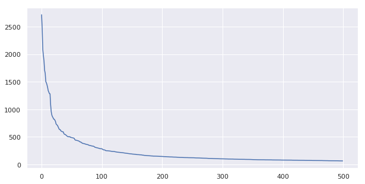

```


```python
import numpy as np
import pandas as pd
import gzip
import csv

import matplotlib
import matplotlib.pyplot as plt
%matplotlib inline

import seaborn as sns
sns.set()

from IPython.display import display

import os
import re
import json

import pylast
```


```python
df_key = pd.read_csv('data' + '/pidpos.csv.gz', compression='gzip', index_col=0)
```


    /home/bkjoye/anaconda3/lib/python3.6/site-packages/numpy/lib/arraysetops.py:522: FutureWarning: elementwise comparison failed; returning scalar instead, but in the future will perform elementwise comparison
      mask |= (ar1 == a)


```python
df_key.head()
```


<div>
<style scoped>
    .dataframe tbody tr th:only-of-type {
        vertical-align: middle;
    }

    .dataframe tbody tr th {
        vertical-align: top;
    }

    .dataframe thead th {
        text-align: right;
    }
</style>
<table border="1" class="dataframe">
  <thead>
    <tr style="text-align: right;">
      <th></th>
      <th>pidpos</th>
      <th>pidpos_id</th>
      <th>track_id</th>
      <th>album_id</th>
      <th>artist_id</th>
      <th>playlist_id</th>
    </tr>
  </thead>
  <tbody>
    <tr>
      <th>281</th>
      <td>4-0</td>
      <td>281</td>
      <td>280</td>
      <td>225</td>
      <td>175</td>
      <td>4</td>
    </tr>
    <tr>
      <th>282</th>
      <td>4-1</td>
      <td>282</td>
      <td>281</td>
      <td>226</td>
      <td>176</td>
      <td>4</td>
    </tr>
    <tr>
      <th>283</th>
      <td>4-2</td>
      <td>283</td>
      <td>282</td>
      <td>227</td>
      <td>177</td>
      <td>4</td>
    </tr>
    <tr>
      <th>284</th>
      <td>4-3</td>
      <td>284</td>
      <td>283</td>
      <td>228</td>
      <td>178</td>
      <td>4</td>
    </tr>
    <tr>
      <th>285</th>
      <td>4-4</td>
      <td>285</td>
      <td>284</td>
      <td>229</td>
      <td>179</td>
      <td>4</td>
    </tr>
  </tbody>
</table>
</div>


```python
df_key.playlist_id.unique().shape
```


    (241878,)


```python
playlist_ids = df_key.playlist_id.unique()
song_ids = df_key.track_id.unique()
album_ids = df_key.album_id.unique()
artist_ids = df_key.artist_id.unique()
```


```python
df_songs = pd.read_csv('data' + '/full_aug_songs.csv.gz', compression='gzip')
```


```python
df_songs.head()
```


<div>
<style scoped>
    .dataframe tbody tr th:only-of-type {
        vertical-align: middle;
    }

    .dataframe tbody tr th {
        vertical-align: top;
    }

    .dataframe thead th {
        text-align: right;
    }
</style>
<table border="1" class="dataframe">
  <thead>
    <tr style="text-align: right;">
      <th></th>
      <th>name</th>
      <th>id</th>
      <th>uri</th>
      <th>duration</th>
      <th>danceability</th>
      <th>energy</th>
      <th>key</th>
      <th>loudness</th>
      <th>mode</th>
      <th>speechiness</th>
      <th>acousticness</th>
      <th>instrumentalness</th>
      <th>liveness</th>
      <th>valence</th>
      <th>tempo</th>
      <th>time_signature</th>
    </tr>
  </thead>
  <tbody>
    <tr>
      <th>0</th>
      <td>lose control feat ciara fat man scoop</td>
      <td>0</td>
      <td>0UaMYEvWZi0ZqiDOoHU3YI</td>
      <td>226.863</td>
      <td>0.904</td>
      <td>0.813</td>
      <td>4</td>
      <td>-7.105</td>
      <td>0</td>
      <td>0.1210</td>
      <td>0.03110</td>
      <td>0.006970</td>
      <td>0.0471</td>
      <td>0.810</td>
      <td>125.461</td>
      <td>4</td>
    </tr>
    <tr>
      <th>1</th>
      <td>toxic</td>
      <td>1</td>
      <td>6I9VzXrHxO9rA9A5euc8Ak</td>
      <td>198.800</td>
      <td>0.774</td>
      <td>0.838</td>
      <td>5</td>
      <td>-3.914</td>
      <td>0</td>
      <td>0.1140</td>
      <td>0.02490</td>
      <td>0.025000</td>
      <td>0.2420</td>
      <td>0.924</td>
      <td>143.040</td>
      <td>4</td>
    </tr>
    <tr>
      <th>2</th>
      <td>crazy in love</td>
      <td>2</td>
      <td>0WqIKmW4BTrj3eJFmnCKMv</td>
      <td>235.933</td>
      <td>0.664</td>
      <td>0.758</td>
      <td>2</td>
      <td>-6.583</td>
      <td>0</td>
      <td>0.2100</td>
      <td>0.00238</td>
      <td>0.000000</td>
      <td>0.0598</td>
      <td>0.701</td>
      <td>99.259</td>
      <td>4</td>
    </tr>
    <tr>
      <th>3</th>
      <td>rock your body</td>
      <td>3</td>
      <td>1AWQoqb9bSvzTjaLralEkT</td>
      <td>267.266</td>
      <td>0.891</td>
      <td>0.714</td>
      <td>4</td>
      <td>-6.055</td>
      <td>0</td>
      <td>0.1400</td>
      <td>0.20200</td>
      <td>0.000234</td>
      <td>0.0521</td>
      <td>0.818</td>
      <td>100.972</td>
      <td>4</td>
    </tr>
    <tr>
      <th>4</th>
      <td>it wasnt me</td>
      <td>4</td>
      <td>1lzr43nnXAijIGYnCT8M8H</td>
      <td>227.600</td>
      <td>0.853</td>
      <td>0.606</td>
      <td>0</td>
      <td>-4.596</td>
      <td>1</td>
      <td>0.0713</td>
      <td>0.05610</td>
      <td>0.000000</td>
      <td>0.3130</td>
      <td>0.654</td>
      <td>94.759</td>
      <td>4</td>
    </tr>
  </tbody>
</table>
</div>


```python
df2_songs = pd.read_csv('data/'+'songs.csv.gz', compression='gzip')
```


```python
df2_songs.head()
```


<div>
<style scoped>
    .dataframe tbody tr th:only-of-type {
        vertical-align: middle;
    }

    .dataframe tbody tr th {
        vertical-align: top;
    }

    .dataframe thead th {
        text-align: right;
    }
</style>
<table border="1" class="dataframe">
  <thead>
    <tr style="text-align: right;">
      <th></th>
      <th>name</th>
      <th>id</th>
      <th>uri</th>
      <th>duration_ms</th>
    </tr>
  </thead>
  <tbody>
    <tr>
      <th>0</th>
      <td>lose control feat ciara fat man scoop</td>
      <td>0</td>
      <td>0UaMYEvWZi0ZqiDOoHU3YI</td>
      <td>226.863</td>
    </tr>
    <tr>
      <th>1</th>
      <td>toxic</td>
      <td>1</td>
      <td>6I9VzXrHxO9rA9A5euc8Ak</td>
      <td>198.800</td>
    </tr>
    <tr>
      <th>2</th>
      <td>crazy in love</td>
      <td>2</td>
      <td>0WqIKmW4BTrj3eJFmnCKMv</td>
      <td>235.933</td>
    </tr>
    <tr>
      <th>3</th>
      <td>rock your body</td>
      <td>3</td>
      <td>1AWQoqb9bSvzTjaLralEkT</td>
      <td>267.266</td>
    </tr>
    <tr>
      <th>4</th>
      <td>it wasnt me</td>
      <td>4</td>
      <td>1lzr43nnXAijIGYnCT8M8H</td>
      <td>227.600</td>
    </tr>
  </tbody>
</table>
</div>


```python
df_artists = pd.read_csv('data/'+'artists.csv.gz', compression='gzip')
```


```python
df_artists.head()
```


<div>
<style scoped>
    .dataframe tbody tr th:only-of-type {
        vertical-align: middle;
    }

    .dataframe tbody tr th {
        vertical-align: top;
    }

    .dataframe thead th {
        text-align: right;
    }
</style>
<table border="1" class="dataframe">
  <thead>
    <tr style="text-align: right;">
      <th></th>
      <th>name</th>
      <th>id</th>
    </tr>
  </thead>
  <tbody>
    <tr>
      <th>0</th>
      <td>missy elliott</td>
      <td>0</td>
    </tr>
    <tr>
      <th>1</th>
      <td>britney spears</td>
      <td>1</td>
    </tr>
    <tr>
      <th>2</th>
      <td>beyonc</td>
      <td>2</td>
    </tr>
    <tr>
      <th>3</th>
      <td>justin timberlake</td>
      <td>3</td>
    </tr>
    <tr>
      <th>4</th>
      <td>shaggy</td>
      <td>4</td>
    </tr>
  </tbody>
</table>
</div>


```python
df_playlists = pd.read_csv('data/'+'playlists.csv.gz', compression='gzip')
```


```python
df_playlists.head()
```


<div>
<style scoped>
    .dataframe tbody tr th:only-of-type {
        vertical-align: middle;
    }

    .dataframe tbody tr th {
        vertical-align: top;
    }

    .dataframe thead th {
        text-align: right;
    }
</style>
<table border="1" class="dataframe">
  <thead>
    <tr style="text-align: right;">
      <th></th>
      <th>id</th>
      <th>name</th>
      <th>num_followers</th>
      <th>collaborative</th>
      <th>num_tracks</th>
      <th>num_albums</th>
    </tr>
  </thead>
  <tbody>
    <tr>
      <th>0</th>
      <td>0</td>
      <td>throwbacks</td>
      <td>1</td>
      <td>1</td>
      <td>52</td>
      <td>47</td>
    </tr>
    <tr>
      <th>1</th>
      <td>1</td>
      <td>awesome playlist</td>
      <td>1</td>
      <td>1</td>
      <td>39</td>
      <td>23</td>
    </tr>
    <tr>
      <th>2</th>
      <td>2</td>
      <td>korean</td>
      <td>1</td>
      <td>1</td>
      <td>64</td>
      <td>51</td>
    </tr>
    <tr>
      <th>3</th>
      <td>3</td>
      <td>mat</td>
      <td>1</td>
      <td>1</td>
      <td>126</td>
      <td>107</td>
    </tr>
    <tr>
      <th>4</th>
      <td>4</td>
      <td>90s</td>
      <td>2</td>
      <td>1</td>
      <td>17</td>
      <td>16</td>
    </tr>
  </tbody>
</table>
</div>


```python
df_playlists.describe()
```


<div>
<style scoped>
    .dataframe tbody tr th:only-of-type {
        vertical-align: middle;
    }

    .dataframe tbody tr th {
        vertical-align: top;
    }

    .dataframe thead th {
        text-align: right;
    }
</style>
<table border="1" class="dataframe">
  <thead>
    <tr style="text-align: right;">
      <th></th>
      <th>id</th>
      <th>num_followers</th>
      <th>collaborative</th>
      <th>num_tracks</th>
      <th>num_albums</th>
    </tr>
  </thead>
  <tbody>
    <tr>
      <th>count</th>
      <td>984547.000000</td>
      <td>984547.000000</td>
      <td>984547.0</td>
      <td>984547.000000</td>
      <td>984547.000000</td>
    </tr>
    <tr>
      <th>mean</th>
      <td>492273.000000</td>
      <td>2.612579</td>
      <td>1.0</td>
      <td>66.388307</td>
      <td>49.626047</td>
    </tr>
    <tr>
      <th>std</th>
      <td>284214.382075</td>
      <td>129.852211</td>
      <td>0.0</td>
      <td>53.685494</td>
      <td>39.993167</td>
    </tr>
    <tr>
      <th>min</th>
      <td>0.000000</td>
      <td>1.000000</td>
      <td>1.0</td>
      <td>5.000000</td>
      <td>2.000000</td>
    </tr>
    <tr>
      <th>25%</th>
      <td>246136.500000</td>
      <td>1.000000</td>
      <td>1.0</td>
      <td>26.000000</td>
      <td>20.000000</td>
    </tr>
    <tr>
      <th>50%</th>
      <td>492273.000000</td>
      <td>1.000000</td>
      <td>1.0</td>
      <td>49.000000</td>
      <td>37.000000</td>
    </tr>
    <tr>
      <th>75%</th>
      <td>738409.500000</td>
      <td>1.000000</td>
      <td>1.0</td>
      <td>92.000000</td>
      <td>68.000000</td>
    </tr>
    <tr>
      <th>max</th>
      <td>984546.000000</td>
      <td>71643.000000</td>
      <td>1.0</td>
      <td>376.000000</td>
      <td>244.000000</td>
    </tr>
  </tbody>
</table>
</div>


```python
df_playlists_trim = df_playlists.iloc[playlist_ids]
```


```python
df_playlists_trim.head()
```


<div>
<style scoped>
    .dataframe tbody tr th:only-of-type {
        vertical-align: middle;
    }

    .dataframe tbody tr th {
        vertical-align: top;
    }

    .dataframe thead th {
        text-align: right;
    }
</style>
<table border="1" class="dataframe">
  <thead>
    <tr style="text-align: right;">
      <th></th>
      <th>id</th>
      <th>name</th>
      <th>num_followers</th>
      <th>collaborative</th>
      <th>num_tracks</th>
      <th>num_albums</th>
    </tr>
  </thead>
  <tbody>
    <tr>
      <th>4</th>
      <td>4</td>
      <td>90s</td>
      <td>2</td>
      <td>1</td>
      <td>17</td>
      <td>16</td>
    </tr>
    <tr>
      <th>8</th>
      <td>8</td>
      <td>bop</td>
      <td>2</td>
      <td>1</td>
      <td>46</td>
      <td>37</td>
    </tr>
    <tr>
      <th>10</th>
      <td>10</td>
      <td>abby</td>
      <td>2</td>
      <td>1</td>
      <td>72</td>
      <td>60</td>
    </tr>
    <tr>
      <th>20</th>
      <td>20</td>
      <td>mixtape</td>
      <td>3</td>
      <td>1</td>
      <td>14</td>
      <td>9</td>
    </tr>
    <tr>
      <th>22</th>
      <td>22</td>
      <td>fall 17</td>
      <td>2</td>
      <td>1</td>
      <td>42</td>
      <td>39</td>
    </tr>
  </tbody>
</table>
</div>


```python
df_playlists_trim.describe()
```


<div>
<style scoped>
    .dataframe tbody tr th:only-of-type {
        vertical-align: middle;
    }

    .dataframe tbody tr th {
        vertical-align: top;
    }

    .dataframe thead th {
        text-align: right;
    }
</style>
<table border="1" class="dataframe">
  <thead>
    <tr style="text-align: right;">
      <th></th>
      <th>id</th>
      <th>num_followers</th>
      <th>collaborative</th>
      <th>num_tracks</th>
      <th>num_albums</th>
    </tr>
  </thead>
  <tbody>
    <tr>
      <th>count</th>
      <td>241878.000000</td>
      <td>241878.000000</td>
      <td>241878.0</td>
      <td>241878.000000</td>
      <td>241878.000000</td>
    </tr>
    <tr>
      <th>mean</th>
      <td>492351.319314</td>
      <td>7.563855</td>
      <td>1.0</td>
      <td>82.227152</td>
      <td>62.454018</td>
    </tr>
    <tr>
      <th>std</th>
      <td>284354.961297</td>
      <td>261.919131</td>
      <td>0.0</td>
      <td>58.002575</td>
      <td>44.234803</td>
    </tr>
    <tr>
      <th>min</th>
      <td>4.000000</td>
      <td>2.000000</td>
      <td>1.0</td>
      <td>5.000000</td>
      <td>2.000000</td>
    </tr>
    <tr>
      <th>25%</th>
      <td>245372.500000</td>
      <td>2.000000</td>
      <td>1.0</td>
      <td>36.000000</td>
      <td>28.000000</td>
    </tr>
    <tr>
      <th>50%</th>
      <td>492954.500000</td>
      <td>2.000000</td>
      <td>1.0</td>
      <td>67.000000</td>
      <td>51.000000</td>
    </tr>
    <tr>
      <th>75%</th>
      <td>737872.000000</td>
      <td>3.000000</td>
      <td>1.0</td>
      <td>116.000000</td>
      <td>87.000000</td>
    </tr>
    <tr>
      <th>max</th>
      <td>984540.000000</td>
      <td>71643.000000</td>
      <td>1.0</td>
      <td>250.000000</td>
      <td>242.000000</td>
    </tr>
  </tbody>
</table>
</div>


```python
df_albums = pd.read_csv('data/'+'albums.csv.gz', compression='gzip')
```


```python
df_albums.head()
```


<div>
<style scoped>
    .dataframe tbody tr th:only-of-type {
        vertical-align: middle;
    }

    .dataframe tbody tr th {
        vertical-align: top;
    }

    .dataframe thead th {
        text-align: right;
    }
</style>
<table border="1" class="dataframe">
  <thead>
    <tr style="text-align: right;">
      <th></th>
      <th>name</th>
      <th>id</th>
    </tr>
  </thead>
  <tbody>
    <tr>
      <th>0</th>
      <td>the cookbook</td>
      <td>0</td>
    </tr>
    <tr>
      <th>1</th>
      <td>in the zone</td>
      <td>1</td>
    </tr>
    <tr>
      <th>2</th>
      <td>dangerously in love alben fr die ewigkeit</td>
      <td>2</td>
    </tr>
    <tr>
      <th>3</th>
      <td>justified</td>
      <td>3</td>
    </tr>
    <tr>
      <th>4</th>
      <td>hot shot</td>
      <td>4</td>
    </tr>
  </tbody>
</table>
</div>


```python
name_counts = df_playlists_trim.name.value_counts()
```


```python
name_counts.shape[0]
```


    14831


```python
fig, ax = plt.subplots(figsize=(10,5))
ax.plot(np.arange(500), name_counts[0:500])
plt.show()
```





```python
name_counts[name_counts>=100].shape
```


    (315,)


```python
groups = df_playlists_trim.groupby(['name'])
```


```python
def divide_df(df, p1, p2, p1_split, p2_split, rest_split):
    split = np.random.randint(1, 11, size=df.shape[0])
    p1_thr = np.int(p1*10)
    p2_thr = np.int((p2+p1)*10)
    p1_split = np.append(p1_split, df.iloc[split <= p1_thr]['id'].values)
    p2_split = np.append(p2_split, df.iloc[(split > p1_thr) & (split <= p2_thr)]['id'].values)
    rest_split = np.append(rest_split, df.iloc[split > p2_thr]['id'].values)
    return p1_split, p2_split, rest_split
```


```python
def split_train_test_validate(df_groupby, test_prop = .1, validate_prop = .1):
    test_id = np.array([])
    train_id = np.array([])
    validate_id = np.array([])
    for name, group in df_groupby:
        if group.shape[0]<100:
            test_id, validate_id, train_id = divide_df(group, test_prop, validate_prop, test_id, validate_id, train_id)
        else:
            group2 = group.sort_values(by='num_followers')
            num_groups = np.int(group2.shape[0]/10)
            step_size = np.int(group2.shape[0]/num_groups)
            for step in range(1, num_groups):
                subgroup = group2.iloc[(step-1)*step_size:step*step_size]
                test_id, validate_id, train_id = divide_df(subgroup, test_prop, validate_prop, test_id, validate_id, train_id)
            subgroup = group2.iloc[step*step_size:]
            test_id, validate_id, train_id = divide_df(subgroup, test_prop, validate_prop, test_id, validate_id, train_id)
    return train_id, test_id, validate_id
```


```python
train_id, test_id, validate_id = split_train_test_validate(groups)
```


```python
train_id.shape[0]/df_playlists_trim.shape[0]
```


    0.8003249572098331


```python
test_id.shape[0]/df_playlists_trim.shape[0]
```


    0.10030676622098744


```python
validate_id.shape[0]/df_playlists_trim.shape[0]
```


    0.0993682765691795


```python
test_id.shape[0]+train_id.shape[0]+validate_id.shape[0], df_playlists_trim.shape[0]
```


    (241878, 241878)


